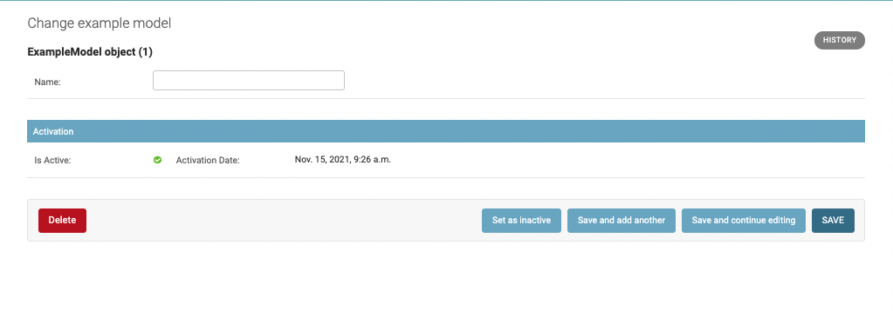
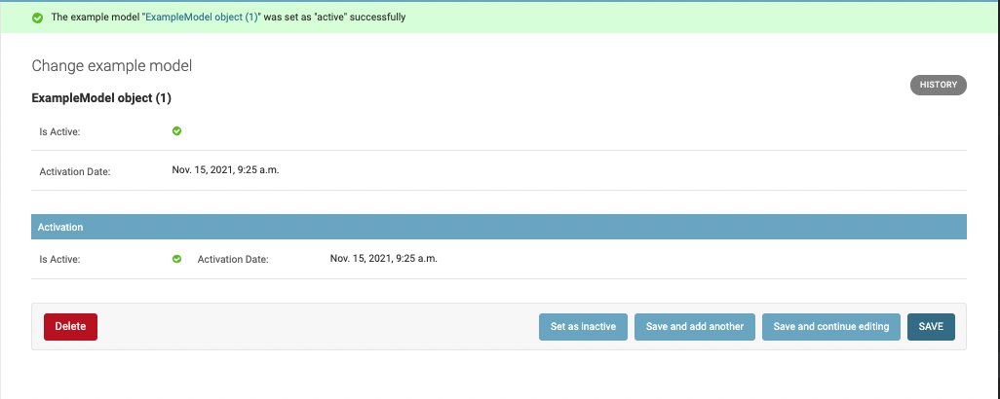
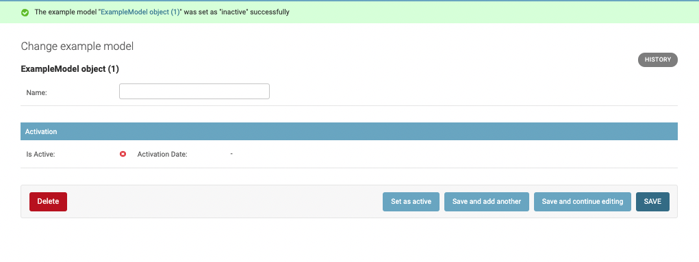
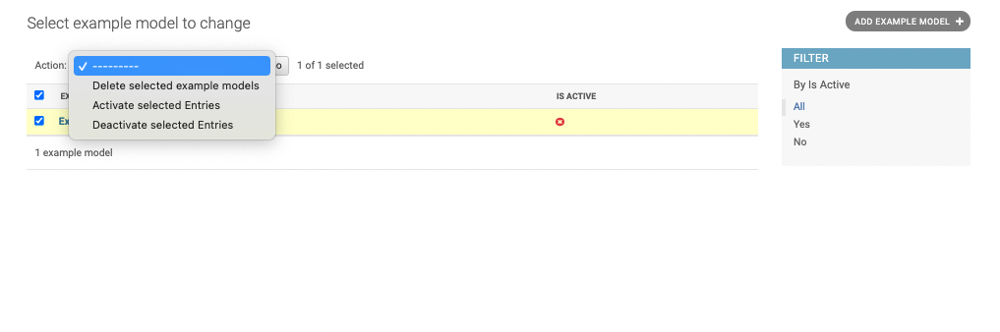

=============================
Django Activation Model Mixin
=============================

.. image:: https://badge.fury.io/py/django-activation-model-mixin.svg/?style=flat-square
    :target: https://badge.fury.io/py/django-activation-model-mixin

.. image:: https://readthedocs.org/projects/pip/badge/?version=latest&style=flat-square
    :target: https://django-activation-model-mixin.readthedocs.io/en/latest/

.. image:: https://img.shields.io/coveralls/github/frankhood/django-activation-model-mixin/master?style=flat-square
    :target: https://coveralls.io/github/frankhood/django-activation-model-mixin?branch=master
    :alt: Coverage Status

This package allows to quickly add an activation/deactivation logic to django models and associated admins.
This means being able to mark an entry as active or inactive, saving the interaction time.
Querysets, Managers and Signals are included.

Documentation
-------------

The full documentation is at https://django-activation-model-mixin.readthedocs.io.

Quickstart
----------

Install Django Activation Model Mixin::

    pip install django-activation-model-mixin

Add it to your `INSTALLED_APPS`:

.. code-block:: python

    INSTALLED_APPS = (
        ...
        'activation_model_mixin',
        ...
    )

Features
--------

* ActivationModelMixin
* ActivationModelMixinAdmin
* ActivationQuerySet
* Actions in admin changelist
* Signals associated to activation action

Example of usage
----------------
.. code-block:: python

    # in your admin.py
    from activation_model_mixin.admin import ActivationModelMixinAdmin
    class ExampleModelAdmin(ActivationModelMixinAdmin, admin.ModelAdmin):
        ...

    admin.site.register(ExampleModel, ExampleModelAdmin)

    # in your models.py
    from activation_model_mixin.models import ActivationModelMixin

    class ExampleModel(ActivationModelMixin, models.Model):
        ...

Admin Interface
---------------

Here some users interface example.

First one is how the change form is shown. There is a new button in the submit row that allows to activate/deactivate one entry.

This is how an accepted entry looks.

This is how a rejected entry looks.

Last image shows actions in the changelist.

Running Tests
-------------

Does the code actually work?

::

    source <YOURVIRTUALENV>/bin/activate
    (myenv) $ pip install tox
    (myenv) $ tox

Development commands
---------------------

::

    pip install -r requirements_dev.txt
    invoke -l

Credits
-------

Tools used in rendering this package:

*  Cookiecutter_
*  `cookiecutter-djangopackage`_

.. _Cookiecutter: https://github.com/audreyr/cookiecutter
.. _`cookiecutter-djangopackage`: https://github.com/pydanny/cookiecutter-djangopackage
